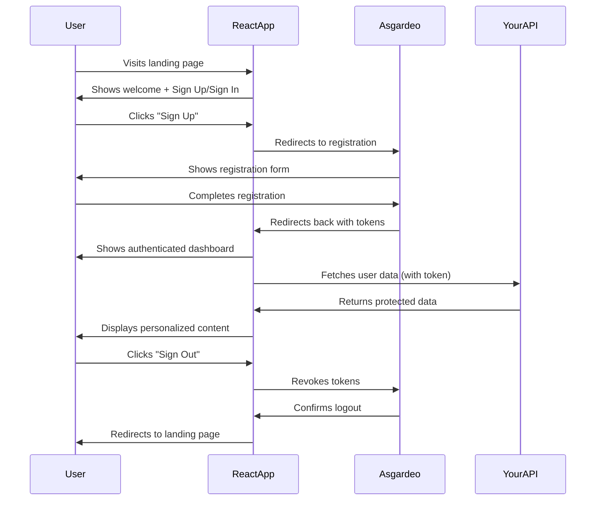

# Securing Your React App with Asgardeo — Sign-In & Self Sign-Up Made Simple

*Published by Kavinda*

---

**"Why spend weeks building authentication from scratch when you can have enterprise-grade security in minutes?"**

As React developers, we've all been there — staring at a blank component wondering how to implement secure user authentication without compromising on user experience or security best practices. Building auth from scratch means dealing with password hashing, session management, OAuth flows, security vulnerabilities, and countless edge cases.

**Enter Asgardeo** — WSO2's cloud-native identity and access management solution that transforms this complexity into a few simple React components.

In just **15 minutes**, you'll have:
- 🔐 Secure sign-in with enterprise-grade authentication
- 📝 Self-service user registration
- 🛡️ Protected routes and API calls
- 👤 User profile management
- 🔄 Seamless logout functionality

No more reinventing the wheel. No more security headaches. Just clean, maintainable code that scales with your application.

Let's dive in! 🚀

---

## 🚀 Getting Started: Asgardeo Setup (5 minutes)

Before we touch any React code, let's get Asgardeo configured. Don't worry — this is the easiest part!

### Step 1: Create Your Asgardeo Account
1. Head over to [Asgardeo Console](https://console.asgardeo.io/)
2. Sign up for a free account (yes, it's free for development!)
3. Verify your email and you're in! 🎉

### Step 2: Register Your React Application
1. In the Asgardeo Console, navigate to **Applications**
2. Click **+ New Application**
3. Choose **Single Page Application** (perfect for React)
4. Configure your app:
   ```
   Application Name: MyReactApp
   Authorized Redirect URIs: http://localhost:3000
   Authorized Origins: http://localhost:3000
   ```

### Step 3: Grab Your Credentials
After creating the application, you'll see:
- **Client ID** — copy this, you'll need it soon
- **Organization Name** — found in your profile/organization settings

> 💡 **Pro Tip**: Keep the Asgardeo console open in another tab. The **Quick Start** section has React-specific examples that complement this tutorial perfectly!

**Ready?** Let's add some authentication magic to your React app! ✨

---

## ⚙️ SDK Setup: Your Gateway to Secure Authentication

### Install the Asgardeo React SDK

```bash
# Using npm
npm install @asgardeo/react

# Using yarn  
yarn add @asgardeo/react

# Using pnpm
pnpm add @asgardeo/react
```

### Configure Authentication Settings

Create `src/config/authConfig.js` to keep your auth settings organized:

```javascript
// src/config/authConfig.js

export const authConfig = {
  // Where users land after successful login
  signInRedirectURL: "http://localhost:3000",
  
  // Where users go after logout
  signOutRedirectURL: "http://localhost:3000", 
  
  // Your app's Client ID from Asgardeo Console
  clientID: "YOUR_CLIENT_ID_HERE",
  
  // Replace YOUR_ORG_NAME with your actual organization name
  baseUrl: "https://api.asgardeo.io/t/YOUR_ORG_NAME",
  
  // What user info you want access to
  scope: ["openid", "profile", "email"],
  
  // Optional: Enable to store tokens securely
  storage: "webWorker"
};
```

### Initialize the Provider

Wrap your app with `AsgardeoProvider` in `src/index.js`:

```jsx
// src/index.js
import React from 'react';
import { createRoot } from 'react-dom/client';
import { AsgardeoProvider } from '@asgardeo/react';
import App from './App';
import { authConfig } from './config/authConfig';

const container = document.getElementById('root');
const root = createRoot(container);

root.render(
  <React.StrictMode>
    <AsgardeoProvider config={authConfig}>
      <App />
    </AsgardeoProvider>
  </React.StrictMode>
);
```

> 🔧 **Common Gotcha**: Make sure your `baseUrl` matches exactly what's shown in your Asgardeo Console. A missing `/` or wrong organization name will cause authentication failures!

The `AsgardeoProvider` does the heavy lifting:
- Initializes the authentication context
- Manages tokens securely
- Handles token refresh automatically
- Provides authentication state to all child components

---

## 🔑 Sign In: One Button, Enterprise Security

Forget complex forms and validation logic. Asgardeo's `SignInButton` handles everything:

### Basic Sign-In Implementation

```jsx
// src/components/LoginPage.jsx
import React from 'react';
import { SignInButton, useAuthContext } from '@asgardeo/react';
import { Navigate } from 'react-router-dom';

function LoginPage() {
  const { state } = useAuthContext();
  
  // Don't show login if user is already authenticated
  if (state.isAuthenticated) {
    return <Navigate to="/dashboard" replace />;
  }

  return (
    <div className="login-container">
      <div className="login-card">
        <h1>Welcome to MyApp</h1>
        <p>Sign in to access your personalized dashboard</p>
        
        <SignInButton 
          className="btn-primary"
          onSignIn={() => console.log('Sign in initiated')}
        >
          🚀 Sign In with Asgardeo
        </SignInButton>
        
        <p className="help-text">
          New here? <a href="/register">Create an account</a>
        </p>
      </div>
    </div>
  );
}

export default LoginPage;
```

### What Happens Behind the Scenes

1. **User clicks** → Redirected to Asgardeo's secure login page
2. **User authenticates** → Asgardeo validates credentials
3. **Success** → User redirected back with secure tokens
4. **Your app** → Automatically detects authentication state

> 💡 **Customization Tip**: The `SignInButton` accepts all standard button props. Style it to match your brand, add loading states, or customize the text!

---

## 📝 Self Sign-Up: Effortless User Onboarding

User registration doesn't get simpler than this. No forms to build, no validation to write, no email verification to implement:

### Complete Registration Flow

```jsx
// src/components/RegisterPage.jsx
import React from 'react';
import { SignUpButton, useAuthContext } from '@asgardeo/react';
import { Navigate, Link } from 'react-router-dom';

function RegisterPage() {
  const { state } = useAuthContext();
  
  // Redirect if already authenticated
  if (state.isAuthenticated) {
    return <Navigate to="/dashboard" replace />;
  }

  return (
    <div className="register-container">
      <div className="register-card">
        <h1>Join MyApp Today</h1>
        <p>Create your account and start exploring in seconds</p>
        
        <div className="features-list">
          ✅ Secure authentication<br/>
          ✅ Instant account activation<br/>
          ✅ No spam, ever<br/>
        </div>
        
        <SignUpButton 
          className="btn-success"
          onSignUp={() => {
            console.log('Registration initiated');
            // Optional: Track analytics event
          }}
        >
          🎉 Create Free Account
        </SignUpButton>
        
        <p className="login-link">
          Already have an account? <Link to="/login">Sign in here</Link>
        </p>
      </div>
    </div>
  );
}

export default RegisterPage;
```

### The Magic of Asgardeo Self Sign-Up

- **Zero form validation** — Asgardeo handles all input validation
- **Built-in security** — Password strength, email verification, bot protection
- **Instant activation** — Users can sign in immediately after registration
- **Customizable fields** — Configure what information you collect in Asgardeo Console

> 🎯 **Pro Feature**: In the Asgardeo Console, you can customize the registration form fields, add terms of service agreements, and even collect custom user attributes!

---

## 🛡️ Route Protection: Fortress-Level Security Made Easy

Protecting sensitive pages is crucial. Asgardeo gives you multiple approaches — choose what fits your app architecture:

### Method 1: Component-Level Protection

Perfect for protecting specific components within a page:

```jsx
// src/components/Dashboard.jsx
import React from 'react';
import { AuthenticatedComponent } from '@asgardeo/react';
import LoginPrompt from './LoginPrompt';

function Dashboard() {
  return (
    <div className="page-container">
      <h1>Analytics Dashboard</h1>
      
      {/* This section only shows to authenticated users */}
      <AuthenticatedComponent 
        fallback={<LoginPrompt message="Sign in to view your analytics" />}
      >
        <div className="dashboard-content">
          <div className="stats-grid">
            <StatCard title="Revenue" value="$12,345" />
            <StatCard title="Users" value="1,234" />
            <StatCard title="Growth" value="+15%" />
          </div>
          <Charts />
        </div>
      </AuthenticatedComponent>
    </div>
  );
}

export default Dashboard;
```

### Method 2: Route-Level Protection with Custom Hook

For React Router users, create a reusable `ProtectedRoute` component:

```jsx
// src/components/ProtectedRoute.jsx
import React from 'react';
import { useAuthContext } from '@asgardeo/react';
import { Navigate, useLocation } from 'react-router-dom';
import LoadingSpinner from './LoadingSpinner';

function ProtectedRoute({ children }) {
  const { state } = useAuthContext();
  const location = useLocation();

  if (state.isLoading) {
    return <LoadingSpinner />;
  }

  if (!state.isAuthenticated) {
    // Redirect to login with return path
    return (
      <Navigate 
        to="/login" 
        state={{ from: location }} 
        replace 
      />
    );
  }

  return children;
}

export default ProtectedRoute;
```

### Method 3: App-Wide Protection with SecureApp

When your entire app requires authentication:

```jsx
// src/App.jsx
import React from 'react';
import { BrowserRouter as Router, Routes, Route } from 'react-router-dom';
import { SecureApp } from '@asgardeo/react';
import Navbar from './components/Navbar';
import Dashboard from './pages/Dashboard';
import Profile from './pages/Profile';
import Settings from './pages/Settings';
import AuthenticatingLoader from './components/AuthenticatingLoader';

function App() {
  return (
    <SecureApp 
      fallback={<AuthenticatingLoader />}
      onSignInRedirect={() => console.log('Redirecting to sign in...')}
    >
      <Router>
        <Navbar />
        <main className="app-content">
          <Routes>
            <Route path="/" element={<Dashboard />} />
            <Route path="/profile" element={<Profile />} />
            <Route path="/settings" element={<Settings />} />
          </Routes>
        </main>
      </Router>
    </SecureApp>
  );
}

export default App;
```

### Usage in Your Router Setup

```jsx
// src/AppRouter.jsx
import React from 'react';
import { Routes, Route } from 'react-router-dom';
import ProtectedRoute from './components/ProtectedRoute';
import Home from './pages/Home';
import Login from './pages/Login';
import Dashboard from './pages/Dashboard';
import Profile from './pages/Profile';

function AppRouter() {
  return (
    <Routes>
      {/* Public routes */}
      <Route path="/" element={<Home />} />
      <Route path="/login" element={<Login />} />
      
      {/* Protected routes */}
      <Route path="/dashboard" element={
        <ProtectedRoute>
          <Dashboard />
        </ProtectedRoute>
      } />
      
      <Route path="/profile" element={
        <ProtectedRoute>
          <Profile />
        </ProtectedRoute>
      } />
    </Routes>
  );
}

export default AppRouter;
```

> 🛡️ **Security Note**: Route protection only controls what users see in the browser. Always validate authentication on your backend APIs too!

---

## 👤 User Information: Everything You Need, Instantly Available

Access rich user data without complex API calls or state management:

### Complete Profile Component

```jsx
// src/components/UserProfile.jsx
import React from 'react';
import { useAuthContext } from '@asgardeo/react';

function UserProfile() {
  const { state } = useAuthContext();

  // Handle loading state
  if (state.isLoading) {
    return (
      <div className="profile-skeleton">
        <div className="skeleton-avatar"></div>
        <div className="skeleton-text"></div>
      </div>
    );
  }

  // Handle unauthenticated state
  if (!state.isAuthenticated) {
    return (
      <div className="profile-card">
        <p>Please sign in to view your profile</p>
      </div>
    );
  }

  // Extract user information from ID token
  const {
    given_name,
    family_name,
    email,
    email_verified,
    picture,
    preferred_username,
    sub: userId
  } = state.idTokenPayload;

  const fullName = `${given_name || ''} ${family_name || ''}`.trim();

  return (
    <div className="profile-card">
      <div className="profile-header">
        
        
        <div className="profile-info">
          <h2>{fullName || preferred_username || 'User'}</h2>
          <p className="email">
            {email}
            {email_verified && (
              <span className="verified-badge">✓ Verified</span>
            )}
          </p>
        </div>
      </div>
      
      <div className="profile-details">
        <div className="detail-row">
          <span className="label">User ID:</span>
          <code className="value">{userId}</code>
        </div>
        
        <div className="detail-row">
          <span className="label">Username:</span>
          <span className="value">{preferred_username || 'Not set'}</span>
        </div>
      </div>
    </div>
  );
}

export default UserProfile;
```

### Available User Data

The `idTokenPayload` contains rich user information:

| Field | Description | Example |
|-------|-------------|---------|
| `sub` | Unique user identifier | `"user123456"` |
| `given_name` | First name | `"John"` |
| `family_name` | Last name | `"Doe"` |
| `email` | Email address | `"john@example.com"` |
| `email_verified` | Email verification status | `true` |
| `picture` | Profile picture URL | `"https://..."` |
| `preferred_username` | Username | `"johndoe"` |

### Custom Hook for User Data

```jsx
// src/hooks/useUser.js
import { useAuthContext } from '@asgardeo/react';

export function useUser() {
  const { state } = useAuthContext();
  
  const user = state.isAuthenticated ? {
    ...state.idTokenPayload,
    fullName: `${state.idTokenPayload.given_name || ''} ${state.idTokenPayload.family_name || ''}`.trim(),
    displayName: state.idTokenPayload.given_name || 
                 state.idTokenPayload.preferred_username || 
                 state.idTokenPayload.email
  } : null;
  
  return {
    user,
    isLoading: state.isLoading,
    isAuthenticated: state.isAuthenticated
  };
}

// Usage in any component:
// const { user, isLoading, isAuthenticated } = useUser();
```

> 💡 **Token Tip**: The data comes from the ID token, which is automatically refreshed by the SDK. No manual API calls needed!

---

## 🔄 Logout: Clean Exit, Complete Security

Secure logout is as important as secure login. Asgardeo handles session cleanup across all devices:

### Simple Logout Button

```jsx
// src/components/LogoutButton.jsx
import React, { useState } from 'react';
import { SignOutButton } from '@asgardeo/react';

function LogoutButton({ className = '', children = 'Sign Out' }) {
  const [isSigningOut, setIsSigningOut] = useState(false);

  const handleSignOut = () => {
    setIsSigningOut(true);
    // Optional: Clear any local app state
    localStorage.removeItem('user-preferences');
    sessionStorage.clear();
  };

  return (
    <SignOutButton 
      className={`logout-btn ${className}`}
      onSignOut={handleSignOut}
      disabled={isSigningOut}
    >
      {isSigningOut ? (
        <>
          <span className="spinner"></span>
          Signing out...
        </>
      ) : (
        children
      )}
    </SignOutButton>
  );
}

export default LogoutButton;
```

### Logout in Navigation Bar

```jsx
// src/components/Navbar.jsx
import React from 'react';
import { useAuthContext } from '@asgardeo/react';
import LogoutButton from './LogoutButton';
import { useUser } from '../hooks/useUser';

function Navbar() {
  const { isAuthenticated } = useAuthContext();
  const { user } = useUser();

  if (!isAuthenticated) return null;

  return (
    <nav className="navbar">
      <div className="nav-brand">
        <h1>MyApp</h1>
      </div>
      
      <div className="nav-menu">
        <a href="/dashboard">Dashboard</a>
        <a href="/profile">Profile</a>
        <a href="/settings">Settings</a>
      </div>
      
      <div className="nav-user">
        <span className="welcome-text">
          Hi, {user?.displayName}!
        </span>
        <LogoutButton className="btn-outline">
          🚪 Sign Out
        </LogoutButton>
      </div>
    </nav>
  );
}

export default Navbar;
```

### What Happens During Logout

1. **Local cleanup** — Your app's local state is cleared
2. **Token revocation** — Access and refresh tokens are invalidated
3. **Session termination** — Asgardeo session is ended
4. **Secure redirect** — User redirected to your `signOutRedirectURL`

> 🔒 **Security Feature**: Asgardeo's logout invalidates tokens across ALL devices where the user is signed in, providing enterprise-grade security!

---

## 🔗 Protected API Calls: Seamless Backend Integration

Asgardeo's HTTP client automatically handles tokens, refreshing, and authentication headers:

### Complete API Integration Example

```jsx
// src/hooks/useApi.js
import { useState, useCallback } from 'react';
import { useAuthContext } from '@asgardeo/react';

export function useApi() {
  const { httpRequest } = useAuthContext();
  const [loading, setLoading] = useState(false);
  const [error, setError] = useState(null);

  const apiCall = useCallback(async (config) => {
    setLoading(true);
    setError(null);
    
    try {
      const response = await httpRequest({
        headers: {
          'Accept': 'application/json',
          'Content-Type': 'application/json',
          ...config.headers
        },
        ...config
      });
      
      setLoading(false);
      return response.data;
    } catch (err) {
      setError(err.message || 'API call failed');
      setLoading(false);
      throw err;
    }
  }, [httpRequest]);

  return { apiCall, loading, error };
}
```

### Real-World Usage Example

```jsx
// src/components/UserDashboard.jsx
import React, { useState, useEffect } from 'react';
import { useApi } from '../hooks/useApi';

function UserDashboard() {
  const { apiCall, loading, error } = useApi();
  const [userData, setUserData] = useState(null);

  // Fetch user profile from your backend
  useEffect(() => {
    const fetchUserData = async () => {
      try {
        const profile = await apiCall({
          method: 'GET',
          url: 'https://your-api.com/api/user/profile'
        });
        setUserData(profile);
        
      } catch (err) {
        console.error('Failed to fetch user data:', err);
      }
    };

    fetchUserData();
  }, [apiCall]);

  if (loading && !userData) {
    return <div className="loading">Loading dashboard...</div>;
  }

  if (error && !userData) {
    return <div className="error">Error: {error}</div>;
  }

  return (
    <div className="dashboard">
      <h1>Welcome back, {userData?.name}!</h1>
      <div className="dashboard-content">
        <p>Your secure content here...</p>
      </div>
    </div>
  );
}

export default UserDashboard;
```

### Key Benefits

- 🔄 **Automatic token refresh** — No expired token errors
- 🔒 **Secure by default** — Tokens never exposed in your code
- 📊 **Error handling** — Built-in retry logic for failed requests
- 🚀 **Performance** — Efficient token caching and reuse

> ⚡ **Performance Tip**: The SDK automatically caches and reuses tokens until they expire, minimizing unnecessary authentication overhead!

---

## 🧭 Complete User Journey: From Landing to Dashboard

Let's trace a complete user experience through your secured React app:

### The Perfect User Flow



### Step-by-Step Implementation

1. **🏠 Landing Page** — Public welcome with clear CTAs
2. **📝 Registration** — One-click sign-up via Asgardeo
3. **🔐 Authentication** — Automatic token handling
4. **📊 Dashboard** — Protected content with user data
5. **👤 Profile Management** — User info from ID tokens
6. **🔌 API Integration** — Secured backend calls
7. **🚪 Clean Logout** — Session termination across devices

---

## ⚠️ Common Gotchas & Troubleshooting

### Configuration Issues

**Problem**: `Invalid redirect URI` error  
**Solution**: Ensure your `signInRedirectURL` exactly matches the authorized redirect URI in Asgardeo Console (including http/https, port, trailing slashes)

**Problem**: `CORS errors` during authentication  
**Solution**: Add your domain to "Allowed Origins" in Asgardeo Console

**Problem**: `Client authentication failed`  
**Solution**: Double-check your `clientID` and `baseUrl` in `authConfig.js`

### Development vs Production

```javascript
// src/config/authConfig.js
const isDev = process.env.NODE_ENV === 'development';

export const authConfig = {
  signInRedirectURL: isDev 
    ? "http://localhost:3000" 
    : "https://myapp.com",
  signOutRedirectURL: isDev 
    ? "http://localhost:3000" 
    : "https://myapp.com",
  clientID: process.env.REACT_APP_ASGARDEO_CLIENT_ID,
  baseUrl: `https://api.asgardeo.io/t/${process.env.REACT_APP_ASGARDEO_ORG}`,
  scope: ["openid", "profile", "email"],
  storage: "webWorker" // More secure than localStorage
};
```

### Token Management Issues

**Problem**: Users get logged out unexpectedly  
**Solution**: Check if your backend API calls are returning 401s, which might trigger logout

**Problem**: "Token expired" errors  
**Solution**: The SDK handles this automatically, but ensure you're using the latest version

### Performance Optimization

```jsx
// Optimize re-renders with useMemo
import React, { useMemo } from 'react';
import { useAuthContext } from '@asgardeo/react';

function UserComponent() {
  const { state } = useAuthContext();
  
  const userInfo = useMemo(() => {
    if (!state.isAuthenticated) return null;
    
    return {
      name: state.idTokenPayload.given_name,
      email: state.idTokenPayload.email,
      isVerified: state.idTokenPayload.email_verified
    };
  }, [state.isAuthenticated, state.idTokenPayload]);

  // Component logic...
}
```

### Testing Your Implementation

```bash
# Test different scenarios
1. Sign up a new user → Check registration flow
2. Sign in existing user → Verify token storage
3. Access protected routes → Confirm route guards work
4. Make API calls → Test automatic token injection
5. Sign out → Verify complete session cleanup
6. Refresh page while authenticated → Check token persistence
```

> 🚨 **Security Reminder**: Never log tokens to console in production! Use `process.env.NODE_ENV` checks for debug logging.

---

## 🚀 Why Asgardeo + React = Developer Paradise

### 🎯 **Zero Security Debt**
Skip months of security research. Asgardeo gives you enterprise-grade authentication that's been battle-tested by thousands of applications.

### ⚡ **Lightning Fast Setup**  
From empty React app to fully authenticated users in under 20 minutes. Compare that to weeks of building custom auth!

### 🔒 **Security by Default**
- OpenID Connect (OIDC) standard compliance
- Automatic token refresh and secure storage  
- Protection against common vulnerabilities (CSRF, XSS)
- SOC 2 Type II certified infrastructure

### 📈 **Scales With Your Growth**
- **Starter**: Basic sign-in/sign-up (what we built today)
- **Growth**: Social logins (Google, GitHub, etc.)
- **Enterprise**: SSO, multi-factor auth, advanced security policies

### 🛠️ **Developer Experience**
```jsx
// This is all you need for authentication:
<SignInButton>Sign In</SignInButton>
<SignUpButton>Sign Up</SignUpButton>

// And this for protection:
<AuthenticatedComponent>
  <SecretContent />
</AuthenticatedComponent>
```

---

## 🎉 You Did It! What's Next?

Congratulations! You now have a React app with production-ready authentication. Your users can sign up, sign in, access protected content, and sign out securely.

### 🔗 Helpful Resources
- [Asgardeo React SDK Documentation](https://github.com/asgardeo/asgardeo-react)
- [Asgardeo Console](https://console.asgardeo.io/) — Manage your applications
- [OpenID Connect Explained](https://openid.net/connect/) — Understand the standard

### 🚀 Level Up Your App
Ready to add more features?
- **Social Login**: Add Google, GitHub, Facebook sign-in options
- **Multi-Factor Auth**: Enable SMS or email-based 2FA
- **Advanced Scopes**: Request additional user permissions
- **Organization Management**: Multi-tenant applications

---

**Found this helpful?** Drop a comment below with your experience or questions. I'd love to hear how you're using Asgardeo in your React applications!

*Happy coding! 🎉*

---

*About the author: Kavinda is a full-stack developer passionate about secure, user-friendly authentication solutions. Follow for more React and security tutorials.*